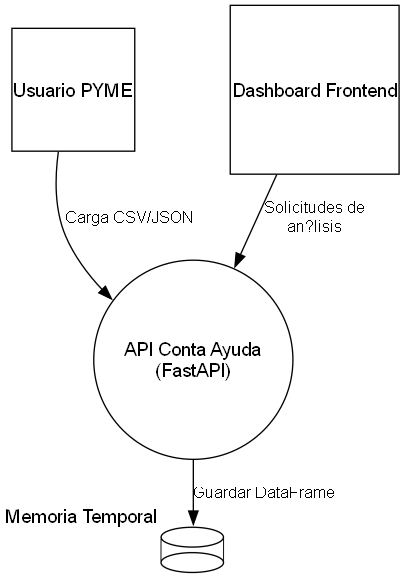

# Threat Model - Conta Ayuda

## Descripción del sistema

{tm.description}

---

# Diagrama de Flujo de Datos

---

# Flujos de Datos

Nombre | Origen | Destino | Protocolo
--- | --- | --- | ---
{dataflows:repeat:{{item.name}} | {{item.source.name}} | {{item.sink.name}} | {{item.protocol}}
}

---

# Amenazas Detectadas

{findings:repeat:
- **ID:** {{item.id}}
- **Amenaza:** {{item.description}}
- **Elemento afectado:** {{item.target}}
- **Severidad:** {{item.severity}}

}